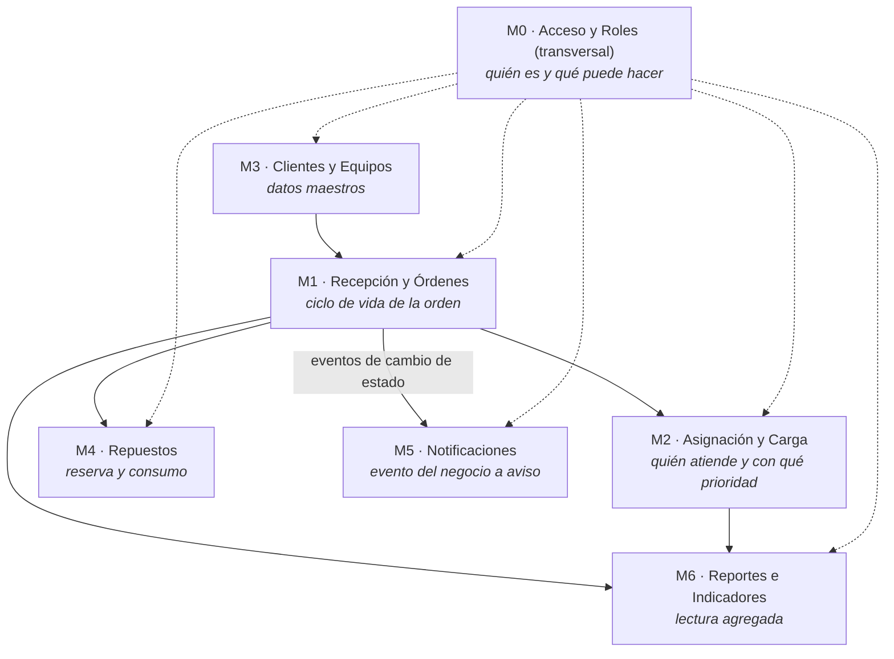
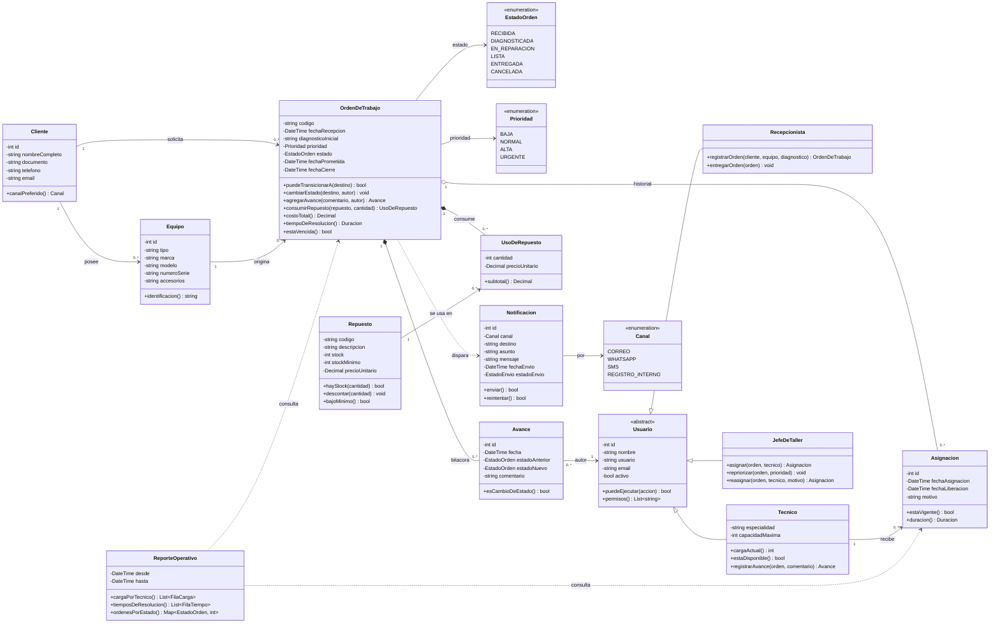
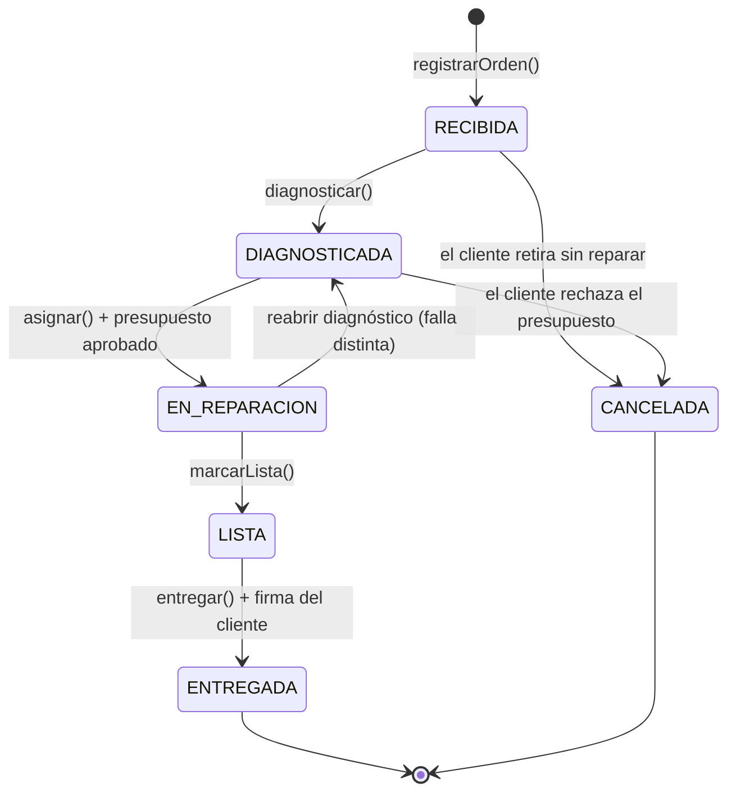

# Expediente de Arquitectura — Órdenes de Trabajo (Taller y Soporte Técnico)

**Estudiante:** Roberto Angel Ayala Lecoña  
**Materia:** Arquitectura de Software · UAB · Gestión 2026-2 · Ing. Josue Chura  
**Repositorio (expediente):** https://github.com/4ngel105/ordenes_de_trabajo  

---

## PROYECTO SELECCIONADO

> ### VARIANTE 6 · ÓRDENES DE TRABAJO — "Taller y soporte técnico" 🔧
>
> **Sistema a diseñar:** **SIGOT** — Sistema de Gestión de Órdenes de Trabajo para un taller de servicio técnico.
>
> **Tecnología elegida para el prototipo:** **Angular** (SPA) consumiendo una API REST.

**Por qué me corresponde esta variante (2 líneas):**  
Mi trabajo real gira alrededor de órdenes de trabajo y soporte: recibir un equipo o ticket, registrarlo con un diagnóstico, asignarlo a alguien y perseguirlo hasta la entrega. Es el mismo ciclo de vida —recepción, asignación, avances, cierre— que describe la Variante 6, así que las entidades y las reglas del caso son las que ya manejo y puedo defender sin inventar.

**Por qué Angular:** el sistema es un panel de trabajo interno usado durante toda la jornada (el técnico carga avances, el jefe reasigna, recepción consulta). Angular me da módulos por *feature* con carga diferida, ruteo con *guards* por rol (RF4) y formularios reactivos con validación fuerte para el registro de la orden (RF1). El mapeo módulo arquitectónico → módulo Angular es 1 a 1, lo que mantiene coherente el diseño con la implementación.

---

## Contenido del expediente

| # | Punto de H1 | Documento |
|---|---|---|
| 1 | README con nombre, variante y justificación | este archivo |
| 2 | Actores del sistema | [docs/01-actores.md](docs/01-actores.md) |
| 3 | Inventario de módulos | [docs/02-modulos.md](docs/02-modulos.md) |
| 4 | Primer diagrama de clases | [docs/03-diagrama-clases.md](docs/03-diagrama-clases.md) |
| 5 | Atributos de calidad críticos | [docs/04-atributos-calidad.md](docs/04-atributos-calidad.md) |
| + | Trazabilidad RF → módulo → clase | [docs/05-trazabilidad-rf.md](docs/05-trazabilidad-rf.md) |
| + | Declaración de uso de IA | [docs/06-declaracion-uso-ia.md](docs/06-declaracion-uso-ia.md) |

Abajo va el resumen de los 5 puntos; cada documento amplía el detalle.

---

## 1. El caso

Un taller recibe equipos (o tickets), los registra con un diagnóstico inicial, los asigna a técnicos según prioridad y sigue cada orden por estados hasta entregarla. **El cliente quiere saber cuándo estará listo; el jefe quiere saber quién tiene qué.**

---

## 2. Actores

| Actor | Tipo | Qué quiere del sistema |
|---|---|---|
| **Cliente** | Externo (no opera el sistema) | Saber en qué estado está su equipo y cuándo puede recogerlo; enterarse sin llamar cuando su orden está lista. |
| **Recepcionista** | Usuario · rol operador | Registrar rápido la orden con el diagnóstico inicial y los datos del equipo; entregar el equipo dejando constancia. |
| **Técnico** | Usuario · rol operador | Ver solo sus órdenes, cargar avances, pedir repuestos y mover el estado de lo que repara. |
| **Jefe de Taller** | Usuario · rol supervisor | Asignar y repriorizar órdenes, ver la carga real de cada técnico y destrabar lo retrasado. |
| **Encargado de Almacén** | Usuario · rol operador (secundario) | Mantener el stock de repuestos y atender las reservas que piden las órdenes. |
| **Servicio de Notificaciones** | Sistema externo | Recibir del sistema el aviso a enviar (correo / mensajería) y devolver si se entregó. |

Detalle y objetivos por actor: [docs/01-actores.md](docs/01-actores.md).

---

## 3. Inventario de módulos (las cajas del sistema)

| Módulo | Responsabilidad **única** |
|---|---|
| **M1 · Recepción y Órdenes** | Registrar la orden con su diagnóstico inicial y custodiar su máquina de estados (nadie más cambia un estado). |
| **M2 · Asignación y Carga** | Decidir y registrar qué técnico atiende cada orden y con qué prioridad, conociendo la capacidad del personal. |
| **M3 · Clientes y Equipos** | Mantener los datos maestros de quién es el cliente y qué equipo/ticket ingresó al taller. |
| **M4 · Repuestos** | Controlar la reserva y el consumo de repuestos que exige una reparación, y su stock. |
| **M5 · Notificaciones** | Traducir un evento del negocio en un aviso al destinatario por el canal que corresponda. |
| **M6 · Reportes e Indicadores** | Producir vistas agregadas de solo lectura para decidir: carga por técnico y tiempos de resolución. |
| **M0 · Acceso y Roles** *(transversal)* | Saber quién es el usuario, qué rol tiene y qué acción puede ejecutar; sella la autoría de cada cambio. |

> **Nota de diseño:** M0 no es una caja más del flujo, es un corte transversal que atraviesa a las otras seis. En Angular se materializa como *guards* de ruta más un `HttpInterceptor`; en el dominio, como la clase abstracta `Usuario` y sus roles.

Justificación de cada módulo y sus fronteras: [docs/02-modulos.md](docs/02-modulos.md).

---

## 4. Primer diagrama de clases

### Máquina de estados de la orden (RF3)

**Decisiones propias de este diagrama** (las defiendo en clase):

1. **`CANCELADA` no estaba en el enunciado y la agregué.** En el taller real la orden muere antes de repararse: el cliente no aprueba el presupuesto o retira el equipo. Sin ese estado terminal esas órdenes quedan eternamente "diagnosticadas" y ensucian todo reporte de tiempos.
2. **`Asignacion` es una clase, no un campo `tecnicoId` dentro de la orden.** La reasignación es cotidiana; guardarla como historial (con fecha y motivo) es lo que permite el reporte de carga por técnico de RF6 y responder "¿quién la tenía cuando se atrasó?".
3. **`Avance` es una bitácora en composición con la orden.** Es la evidencia de trazabilidad: el estado que se muestra siempre tiene un quién, un cuándo y un porqué detrás.
4. **`OrdenDeTrabajo` no expone `setEstado()`,** solo `cambiarEstado(destino, autor)` validado por `puedeTransicionarA()`. La regla de transición vive en el dominio, no en la pantalla de Angular.

Diagrama ampliado, invariantes y reglas: [docs/03-diagrama-clases.md](docs/03-diagrama-clases.md).

---

## 5. Mis dos atributos de calidad críticos

### 5.1 Mantenibilidad (modificabilidad) — crítico

Las reglas de asignación y priorización del taller **cambian todo el tiempo**: hoy se asigna por especialidad, mañana por menor carga, en temporada alta por antigüedad del ticket. Si esa regla vive incrustada dentro de `OrdenDeTrabajo`, cada cambio de política del jefe obliga a tocar el corazón del dominio y a volver a probar todo el ciclo de vida. Por eso la aíslo detrás de una interfaz `EstrategiaDeAsignacion` en M2: **cambiar la regla debe significar agregar una clase, nunca modificar la orden** (escenario medible: nueva regla implementada y en producción en ≤ 1 día, sin tocar M1).

### 5.2 Fiabilidad — crítico

El sistema solo sirve si el estado que muestra **es el estado real del equipo**. Toda la operación cuelga de ese dato: el cliente viene al taller porque le avisamos "lista" y el jefe reasigna porque cree que algo está "en reparación". Un estado falso o un aviso perdido cuesta un viaje en vano y la confianza del cliente. Lo sostengo con tres decisiones: transiciones validadas en el dominio (no existe cambio de estado libre), bitácora `Avance` inmutable con autor y fecha para cada movimiento, y notificaciones con estado de envío y reintento, de modo que un aviso caído se detecte en vez de desaparecer en silencio.

### 5.3 ¿Y la eficiencia cuando entran 50 órdenes juntas?

La **reconozco como importante pero no crítica, y lo asumo explícitamente.** 50 órdenes simultáneas es un volumen bajo para cualquier base relacional: se resuelve con índices por `estado`, `tecnico` y `fechaRecepcion`, paginación en el listado y carga diferida de módulos en Angular; no exige otra arquitectura. Priorizar eficiencia por encima de mantenibilidad me llevaría a optimizaciones prematuras (cachés, desnormalización) que endurecen justo la parte que más cambia: las reglas de asignación. La cola del taller la limita el tiempo del técnico, no el tiempo de la consulta.

Argumento completo y escenarios de calidad: [docs/04-atributos-calidad.md](docs/04-atributos-calidad.md).

---

## Cobertura de los 6 requerimientos funcionales

| RF | Aterrizaje en el caso | Módulo | Clases protagonistas |
|---|---|---|---|
| RF1 Registrar | Registrar orden con diagnóstico inicial, cliente y equipo | M1, M3 | `OrdenDeTrabajo`, `Cliente`, `Equipo` |
| RF2 Listar y buscar | Buscar órdenes por técnico, estado o cliente | M1, M2 | `OrdenDeTrabajo`, `Asignacion` |
| RF3 Flujo de estados | recibida → diagnosticada → en reparación → lista → entregada (+ cancelada) | M1 | `OrdenDeTrabajo`, `EstadoOrden`, `Avance` |
| RF4 Roles | El técnico actualiza avances; el jefe de taller asigna y prioriza | M0, M2 | `Usuario`, `Tecnico`, `JefeDeTaller` |
| RF5 Notificar | Aviso al cliente cuando la orden pasa a **LISTA** | M5 | `Notificacion`, `Canal` |
| RF6 Reportar | Carga de trabajo por técnico y tiempos de resolución | M6 | `ReporteOperativo`, `Asignacion` |

Detalle: [docs/05-trazabilidad-rf.md](docs/05-trazabilidad-rf.md).

---

## Hoja de ruta del expediente

| Hito | Entrega | Vence | Estado |
|---|---|---|---|
| **H1** | Inventario del caso: actores, módulos y primer diagrama de clases | dom 30-ago |  entregado |
| H2 | Diagrama de clases con SOLID aplicado (refactor antes/después) | dom 6-sep | pendiente |
| H3 | Al menos 2 patrones de diseño aplicados, con justificación | dom 13-sep | pendiente |
| H4 | Diagramas C4 niveles 1-2 en Mermaid + 1 ADR | dom 20-sep | pendiente |
| Defensa | Expediente completo + preguntas técnicas + cambio en vivo | jue 24-sep | pendiente |

**Uso de IA declarado:** [docs/06-declaracion-uso-ia.md](docs/06-declaracion-uso-ia.md)
