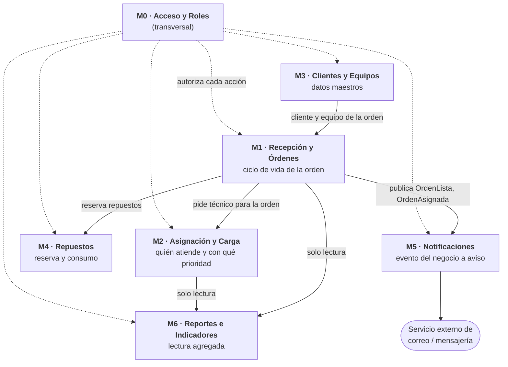

# 3. Inventario de módulos

**Variante 6 · Órdenes de trabajo — "Taller y soporte técnico"**  
Roberto Angel Ayala Lecoña

**Criterio con el que corté las cajas:** cada módulo agrupa lo que **cambia por la misma razón** y tiene **una sola** responsabilidad enunciable en una línea. Si al describir un módulo necesito la palabra "y" para unir dos ideas distintas, está mal cortado.

---

## Vista de módulos

---

## Los módulos, uno por uno

### M1 · Recepción y Órdenes
**Responsabilidad única:** registrar la orden con su diagnóstico inicial y **custodiar su máquina de estados**.

- Es el núcleo del sistema: la orden nace, transita y muere acá.
- **Nadie fuera de M1 cambia un estado.** M2 pide "asignada", M4 informa "repuesto consumido", pero la transición la valida y ejecuta M1. Esta es la frontera que sostiene la fiabilidad.
- Publica los eventos del negocio (`OrdenAsignada`, `OrdenLista`, `OrdenEntregada`) que consumen M5 y M6. No conoce a quién los escucha (candidato a **Observer** en H3).
- Clases: `OrdenDeTrabajo`, `EstadoOrden`, `Prioridad`, `Avance`.
- En Angular: módulo `ordenes` con carga diferida (`/ordenes`, `/ordenes/:codigo`).

### M2 · Asignación y Carga
**Responsabilidad única:** decidir y registrar qué técnico atiende cada orden y con qué prioridad, conociendo la capacidad del personal.

- Está separado de M1 por una razón concreta: **es lo que más cambia**. Las reglas de asignación (por especialidad, por menor carga, por antigüedad del ticket) cambian por decisión del jefe, mientras que el ciclo de vida de la orden casi no cambia. Distinto ritmo de cambio, distinta caja.
- Conoce a los técnicos y su capacidad porque esa es la entrada de la decisión de asignar; no administra credenciales (eso es M0).
- Clases: `Asignacion`, `Tecnico`, la interfaz `EstrategiaDeAsignacion` (se formaliza en H3).
- En Angular: módulo `asignacion` con el tablero de carga del jefe de taller, protegido por `rolGuard('JEFE_TALLER')`.

### M3 · Clientes y Equipos
**Responsabilidad única:** mantener los datos maestros de quién es el cliente y qué equipo/ticket ingresó al taller.

- Es un módulo de catálogo: cambia poco y lo consulta todo el mundo.
- Un mismo cliente puede traer el mismo equipo varias veces; separarlo de la orden evita re-tipear sus datos en cada visita y permite ver el historial del equipo.
- Clases: `Cliente`, `Equipo`.
- En Angular: módulo `clientes`.

### M4 · Repuestos
**Responsabilidad única:** controlar la reserva y el consumo de repuestos que exige una reparación, y su stock.

- Tiene su propia regla dura: no se puede consumir lo que no hay. Esa validación es de M4, no de la orden.
- Clases: `Repuesto`, `UsoDeRepuesto`.
- En Angular: módulo `repuestos`.

### M5 · Notificaciones
**Responsabilidad única:** traducir un evento del negocio en un aviso al destinatario por el canal que corresponda.

- Se suscribe a los eventos de M1; **M1 no sabe que existe**. Así, agregar WhatsApp o cambiar de proveedor de correo no toca el dominio.
- Guarda el estado de envío y reintenta lo que falló: un aviso perdido tiene que ser visible, no silencioso.
- Clases: `Notificacion`, `Canal`, `EstadoEnvio`.
- En Angular: el aviso se dispara del lado del servidor; la SPA solo muestra el historial de avisos de la orden.

### M6 · Reportes e Indicadores
**Responsabilidad única:** producir vistas agregadas **de solo lectura** para decidir: carga por técnico y tiempos de resolución.

- Es de solo lectura por diseño: un reporte jamás modifica una orden. Eso permite después optimizarlo (vistas, índices, réplica de lectura) sin poner en riesgo el dominio.
- Clases: `ReporteOperativo` y sus filas de resultado.
- En Angular: módulo `reportes` con carga diferida y filtros por período.

### M0 · Acceso y Roles *(corte transversal)*
**Responsabilidad única:** saber quién es el usuario, qué rol tiene y qué acción puede ejecutar; y sellar la autoría de cada cambio.

- No es un paso del flujo, es una capa que atraviesa a las otras seis; por eso lo dibujo con línea punteada y no lo cuento entre las cajas del flujo principal.
- Clases: `Usuario` (abstracta), `Recepcionista`, `Tecnico`, `JefeDeTaller`.
- En Angular: `AuthGuard` + `rolGuard` en las rutas y un `HttpInterceptor` que adjunta el token; el permiso real se vuelve a verificar en el servidor (la pantalla oculta botones, no protege datos).

---

## Coherencia módulos ↔ clases

| Módulo | Clases que viven adentro |
|---|---|
| M1 · Recepción y Órdenes | `OrdenDeTrabajo`, `EstadoOrden`, `Prioridad`, `Avance` |
| M2 · Asignación y Carga | `Asignacion`, `Tecnico` (como capacidad de trabajo) |
| M3 · Clientes y Equipos | `Cliente`, `Equipo` |
| M4 · Repuestos | `Repuesto`, `UsoDeRepuesto` |
| M5 · Notificaciones | `Notificacion`, `Canal`, `EstadoEnvio` |
| M6 · Reportes e Indicadores | `ReporteOperativo`, `FilaCarga`, `FilaTiempo` |
| M0 · Acceso y Roles | `Usuario`, `Recepcionista`, `Tecnico` (como identidad), `JefeDeTaller` |

> **`Tecnico` aparece en dos módulos y es a propósito:** en M0 es una **identidad** (quién se autentica y qué puede hacer) y en M2 es una **capacidad de trabajo** (cuántas órdenes soporta). Hoy son una sola clase; en H2 esa doble responsabilidad es exactamente el olor que voy a atacar con SRP, separando `Usuario` de un `PerfilDeCapacidad`. Lo dejo anotado acá para que el refactor del H2 tenga un antes real que mostrar.
