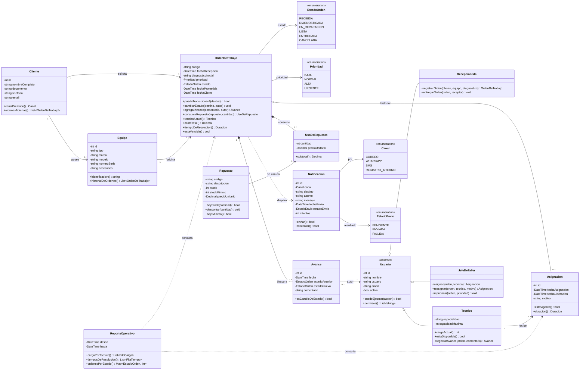
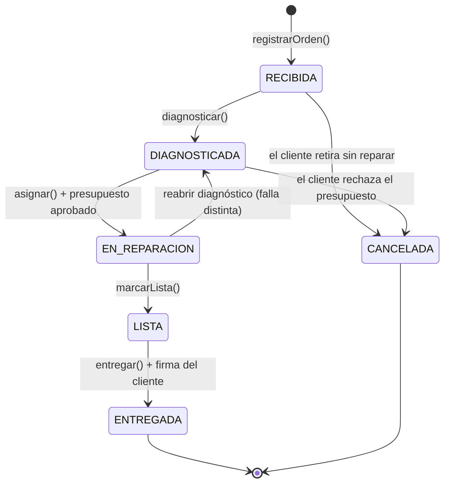

# 4. Primer diagrama de clases

**Variante 6 · Órdenes de trabajo — "Taller y soporte técnico"**  

---

## Diagrama completo

---

## Lectura de las relaciones (por qué cada una es lo que es)

| Relación | Tipo | Por qué |
|---|---|---|
| `OrdenDeTrabajo` ◆── `Avance` | **Composición** | Un avance no existe fuera de su orden. Si la orden se borra, su bitácora no tiene sentido. |
| `OrdenDeTrabajo` ◆── `UsoDeRepuesto` | **Composición** | El detalle de consumo es parte de la orden; el `Repuesto` en cambio vive solo en el catálogo. |
| `OrdenDeTrabajo` ◇── `Asignacion` | **Agregación** | La asignación tiene identidad y vida propia (se consulta para el reporte de carga aunque la orden ya se haya cerrado). |
| `Cliente` ──> `Equipo` | Asociación 1..* | El cliente puede traer varios equipos; el equipo pertenece a un cliente. |
| `Equipo` ──> `OrdenDeTrabajo` | Asociación 1..* | El mismo equipo puede volver al taller muchas veces: eso es su historial. |
| `Usuario` ◁── `Tecnico` / `JefeDeTaller` / `Recepcionista` | **Herencia** | Comparten identidad y permisos, difieren en qué acciones pueden ejecutar (RF4). |
| `OrdenDeTrabajo` ┈> `Notificacion` | **Dependencia** | La orden **dispara** un evento; no guarda ni conoce las notificaciones. Frontera deliberada para poder meter Observer en H3. |
| `ReporteOperativo` ┈> `OrdenDeTrabajo` | **Dependencia** | Solo lectura: el reporte consulta, nunca modifica. |

---

## Máquina de estados (RF3)

### Tabla de transiciones permitidas

| Desde \ Hacia | RECIBIDA | DIAGNOSTICADA | EN_REPARACION | LISTA | ENTREGADA | CANCELADA |
|---|:--:|:--:|:--:|:--:|:--:|:--:|
| **RECIBIDA** | — | ✅ | ❌ | ❌ | ❌ | ✅ |
| **DIAGNOSTICADA** | ❌ | — | ✅ | ❌ | ❌ | ✅ |
| **EN_REPARACION** | ❌ | ✅ | — | ✅ | ❌ | ❌ |
| **LISTA** | ❌ | ❌ | ❌ | — | ✅ | ❌ |
| **ENTREGADA** | ❌ | ❌ | ❌ | ❌ | — | ❌ |
| **CANCELADA** | ❌ | ❌ | ❌ | ❌ | ❌ | — |

Esta tabla es la implementación de `puedeTransicionarA(destino)`. Hoy vive como un `switch` dentro de `OrdenDeTrabajo`; en **H3 es mi candidata natural al patrón State**, y el `switch` de hoy es el "antes" que voy a mostrar.

---

## Invariantes del dominio (las reglas que el diseño debe hacer imposibles de romper)

1. **No hay salto de estado.** Toda transición pasa por `cambiarEstado()`, que consulta `puedeTransicionarA()`. No existe un `setEstado()` público.
2. **Todo cambio de estado deja rastro.** `cambiarEstado()` crea siempre un `Avance` con autor, fecha, estado anterior y nuevo. La bitácora no se edita ni se borra.
3. **Una orden tiene como máximo una `Asignacion` vigente.** Reasignar cierra la anterior con `fechaLiberacion` y motivo, y abre una nueva.
4. **No se pasa a `EN_REPARACION` sin técnico asignado.** El estado y la asignación no pueden contradecirse.
5. **No se consume un repuesto sin stock.** `consumirRepuesto()` delega en `Repuesto.hayStock()` antes de descontar.
6. **`ENTREGADA` y `CANCELADA` son terminales.** Una orden cerrada no vuelve a abrirse: si el equipo regresa, es una **orden nueva** (así el reporte de tiempos no se contamina).
7. **El código de orden es único e inmutable.** Es el dato con el que el cliente pregunta por su equipo.

---

## Lo que ya sé que voy a refactorizar (insumo para H2)

Dejo por escrito los tres olores que este primer diagrama todavía tiene, para que el refactor SOLID del H2 tenga un punto de partida honesto:

- **`OrdenDeTrabajo` hace demasiado** (SRP): custodia estados, calcula costo y calcula tiempos. Voy a separar los cálculos de reporte del ciclo de vida.
- **El `switch` de transiciones crece con cada estado nuevo** (OCP): agregar un estado obliga a modificar la clase. Candidato a State/Strategy.
- **`Tecnico` mezcla identidad y capacidad de trabajo** (SRP): es usuario que se autentica y a la vez recurso con carga máxima. Voy a separar `Usuario` de `PerfilDeCapacidad`.
