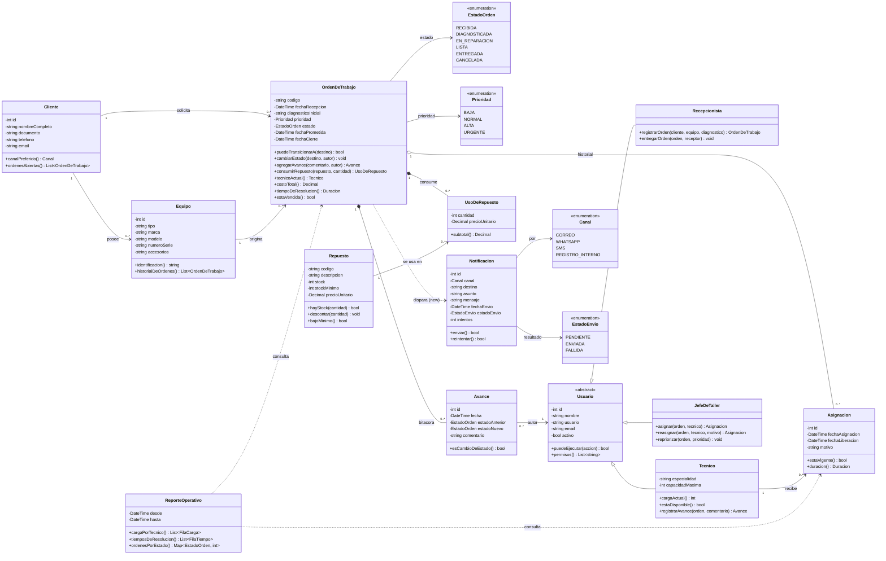
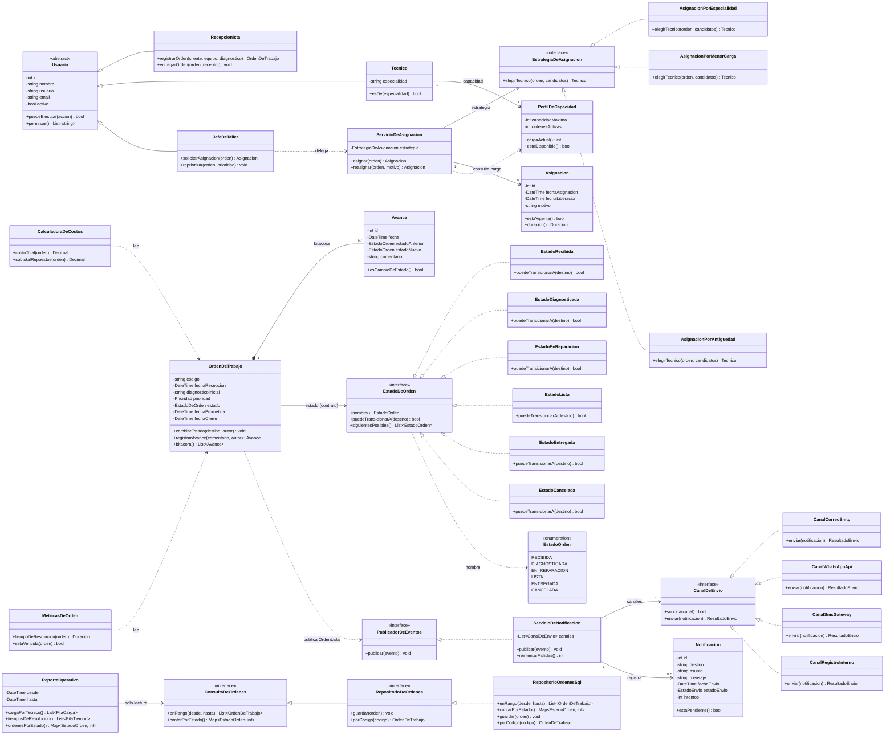

# H2 — Diagrama de clases con SOLID aplicado

**Variante 6 · Órdenes de trabajo — "Taller y soporte técnico" (SIGOT)**
Roberto Angel Ayala Lecoña · Arquitectura de Software · UAB · Gestión 2026-2 · Ing. Josue Chura
**Entrega:** H2 — vence dom 6-sep-2026, 23:59

---

## Archivos de esta entrega

| Archivo | Qué es |
|---|---|
| [`antes.drawio`](antes.drawio) | Diagrama **ANTES**: el modelo del H1 tal cual, con los seis olores marcados en rojo |
| [`despues.drawio`](despues.drawio) | Diagrama **DESPUÉS**: el modelo con SOLID aplicado, interfaces en verde y clases nuevas en amarillo |
| este `README.md` | Los dos diagramas también en Mermaid (se ven directo en GitHub) + el texto del refactor |

Los `.drawio` se abren en [app.diagrams.net](https://app.diagrams.net) (*File → Open from → Device*) o con la extensión **Draw.io Integration** de VS Code. Están guardados **sin comprimir**, así que el diff de git es legible.

---

## 1. ANTES — el diagrama del H1 y sus problemas

Este es el modelo del H1 **sin retoques**: los mismos atributos, los mismos métodos y las mismas relaciones que entregué el 30-ago. Lo que agrego acá no son cambios, son las notas rojas que señalan lo que ya estaba mal.

### Los olores del ANTES

| # | Dónde | Qué está mal | Principio roto |
|---|---|---|---|
| 1 | `OrdenDeTrabajo` | **Clase gorda.** Custodia el ciclo de vida, calcula el costo (`costoTotal()`) y calcula tiempos (`tiempoDeResolucion()`, `estaVencida()`). Un cambio de tarifa obliga a tocar la clase que guarda los estados. | **SRP** |
| 2 | `OrdenDeTrabajo.puedeTransicionarA()` | **Switch por tipo.** La tabla de transiciones vive como un `switch` sobre `EstadoOrden` dentro de la clase. Agregar un estado obliga a modificarla y a re-probar todo el ciclo de vida. | **OCP** |
| 3 | `Notificacion.enviar()` | **Switch por tipo + `new` incrustado.** Hace `switch(canal)` y adentro instancia el proveedor concreto (`new ClienteSmtp()`). Sumar WhatsApp obliga a modificar la clase, y no se la puede probar sin mandar correos de verdad. | **OCP** + **DIP** |
| 4 | `OrdenDeTrabajo ..> Notificacion` | **`new` incrustado en el dominio.** La orden crea sus `Notificacion` con `new`: M1 (dominio) queda dependiendo de M5 (infraestructura) en vez de depender de un contrato. | **DIP** |
| 5 | `ReporteOperativo` | **Módulo de lectura con acceso total.** Alcanza las clases concretas del dominio y ve su API completa, incluida la de escritura, aunque por diseño M6 es de solo lectura. | **ISP** + **DIP** |
| 6 | `Tecnico` | **Doble responsabilidad.** Es identidad que se autentica (M0) y a la vez recurso con capacidad de trabajo (M2). Dos módulos, dos ritmos de cambio, una sola clase. | **SRP** |

> Los olores 1, 2 y 6 ya los había dejado anotados por escrito en el H1, en la sección *"Lo que ya sé que voy a refactorizar"* de [`../docs/03-diagrama-clases.md`](../docs/03-diagrama-clases.md). Los olores 3, 4 y 5 los detecté al preparar este hito.

---

## 2. DESPUÉS — el mismo modelo con SOLID aplicado

`Cliente`, `Equipo`, `Repuesto`, `UsoDeRepuesto` y `Prioridad` no cambian con este refactor y se omiten para no ensuciar el foco; están completos en el ANTES.

---

## 3. Qué cambié y qué principio me pidió cada cambio

1. Partí `OrdenDeTrabajo`: saqué `costoTotal()`, `tiempoDeResolucion()` y `estaVencida()` a `CalculadoraDeCostos` y `MetricasDeOrden`, porque **SRP** pide una sola razón para cambiar y esa clase tenía tres —el ciclo de vida, la tarifa y el SLA— y un cambio de tarifa terminaba tocando la clase que custodia los estados.
2. Separé `Tecnico` en identidad (M0) y `PerfilDeCapacidad` (M2), también por **SRP**: autenticar a una persona y medir su carga de trabajo son dos módulos distintos y cambian por razones distintas.
3. Reemplacé el `switch` de `puedeTransicionarA()` por la interfaz `EstadoDeOrden` con una clase por estado, porque **OCP** exige que agregar un estado sea *agregar una clase* y no modificar la orden ni re-probar todo su ciclo de vida.
4. Metí `EstrategiaDeAsignacion` como interfaz con tres implementaciones intercambiables, otra vez por **OCP**: es la promesa concreta que hice en el H1 al declarar la mantenibilidad como atributo de calidad crítico.
5. Saqué el `new` del dominio: la orden ahora depende de `PublicadorDeEventos` y el `switch(canal)` pasó a implementaciones de `CanalDeEnvio`, por **DIP** —tanto el dominio como la infraestructura dependen del contrato, y ninguno del otro.
6. Separé `ConsultaDeOrdenes` (lectura) de `RepositorioDeOrdenes` (escritura) y dejé que `ReporteOperativo` dependa solo de la primera, por **ISP**: M6 es de solo lectura por diseño y ahora eso lo garantiza el tipo, no la disciplina del programador.
7. Fijé por **LSP** el contrato de las jerarquías nuevas: toda implementación de `CanalDeEnvio` devuelve `ResultadoEnvio` y nunca lanza una excepción propia, y ningún `EstadoDeOrden` tiene efectos secundarios; si una implementación rompe eso, el polimorfismo de los puntos 3 y 5 deja de ser seguro.

---

## Anexo — lo que deliberadamente **no** convertí en interfaz

Para que los principios no queden decorativos, dejo por escrito dónde me frené:

- **`CalculadoraDeCostos` y `MetricasDeOrden` son clases concretas, sin interfaz.** Hoy hay una sola política de costo y una sola de tiempos. Ponerles un contrato sería inventar un punto de extensión que nadie pidió: SRP justifica separarlas, OCP todavía no justifica abstraerlas.
- **`Cliente`, `Equipo` y `Repuesto` quedan igual que en el H1.** Son datos maestros con una sola responsabilidad y sin `switch`; tocarlos habría sido refactor por refactor.
- **El refactor del punto 3 es, en patrones, el patrón State.** En este hito lo argumento solo como **OCP** (polimorfismo en lugar de `switch`); lo nombro y lo justifico formalmente como patrón en el H3, junto con Strategy sobre `EstrategiaDeAsignacion`.
